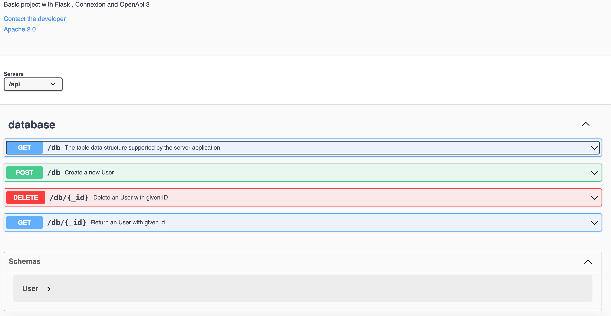

# python-flask-basic
     

Connexion is a modern Python web framework (build & install a enviroment using this script `./create_virtual_env.sh`) that makes spec-first and api-first development easy. You describe your API in an OpenAPI (or swagger) specification with as much detail as you want and Connexion will guarantee that it works as you specified. Also it can be test a few function as background job (a process that runs in the background, `https://github.com/euiyounghwang/python-flask-basic/blob/master/job/job.py`) in your API.

Based on your specification, Connexion provides the following functionality:
- Automatic routing to your Python functions
- Authentication
- Request validation
- Parameter parsing and injection
- Response serialization
- Response validation
- A Swagger UI console with live documentation and ‘try it out’ feature


#### Install Poerty
```bash
https://python-poetry.org/docs/?ref=dylancastillo.co#installing-with-the-official-installer
```


#### Using Python Virtual Environment
```bash
python -m venv .venv
source .venv/bin/activate

# Migrate
alembic init alembic
alembic revision -m "first migrations"
alembic upgrade head


# new revision add
$> alembic revision
$> alembic revision -m "message" # add message

# write revistion after detecting the changes from alembic
$> alembic revision --autogenerate
$> alembic revision --autogenerate -m "message"
```


#### Using Poetry: Create the virtual environment in the same directory as the project and install the dependencies with basic library:
```bash
poetry config virtualenvs.in-project true
poetry init
poetry add uvicorn
poetry add pytest
poetry add "connexion[swagger-ui]"
poetry add "connexion[flask]"
poetry add "connexion[swagger-ui]"
```


#### Handling with different user for github when pushing the commit
```bash
(.venv) ➜  python-flask-basic git:(master) git push -u origin master
remote: Permission to euiyounghwang/python-flask-basic.git denied to euiyounghwang1.
fatal: unable to access 'https://github.com/euiyounghwang/python-flask-basic.git/': The requested URL returned error: 403
(.venv) ➜  python-flask-basic git:(master) git config --local credential.helper ""
```

#### Run Service
```bash
http://localhost:5000/api/ui/
```


#### Push Docker-io with my account
```bash

docker login -u "euiyoung" -p "<password>" docker.io

docker push euiyoung/fn-flask-basic-api:es

(.venv) ➜  python-elasticsearch git:(master) docker push euiyoung/fn-flask-basic-api:es
The push refers to repository [docker.io/euiyoung/fn-flask-basic-api]
5d647ec1a1fb: Pushed
fd06eaaba40d: Pushed
64affd5054b0: Pushed
0d9bf610013e: Pushed
ddb6a9981c5b: Pushed
91f013cc9ad4: Pushed
1d228a5c814d: Pushed
96241174affd: Pushed
174a3bb9cb52: Pushed
f69e96eb5a0c: Pushed
44ea9a923069: Pushed
4b9bc13fb5b2: Pushed
c9f974dacf48: Pushed
cdc9dae211b4: Pushed
7095af798ace: Pushed
fe6a4fdbedc0: Pushed
e4d0e810d54a: Pushed
4e006334a6fd: Pushed
es: digest: sha256:1154c1125dca43ae585f45af4bf0df9374eecf05ab35d3fb9ac5131e97b0ce22 size: 4101
```


### Swagger for REST-API



### Pytest
- Docker with py.test
```bash
fn-flask-basic-api-test
euiyoung/fn-flask-basic-api:test
76ff0f2223a2
15001:5001

2024-01-27 22:23:54 ============================= test session starts ==============================
2024-01-27 22:23:54 platform linux -- Python 3.6.13, pytest-7.0.1, pluggy-1.0.0 -- /usr/local/bin/python
2024-01-27 22:23:54 cachedir: .pytest_cache
2024-01-27 22:23:54 rootdir: /app/FN-BEES-Services/tests, configfile: pytest.ini
2024-01-27 22:23:54 plugins: cov-4.0.0, mock-3.6.1
2024-01-27 22:23:54 collecting ... collected 1 item
2024-01-27 22:23:54 
2024-01-27 22:23:55 tests/test_api.py::BaseTestAliveController::test_get_restful PASSED      [100%]
2024-01-27 22:23:55 
2024-01-27 22:23:55 ============================== 1 passed in 1.05s ===============================
```
- py.test -v ./tests --cov-report term-missing --cov
```bash
(.venv) ➜  python-flask-basic git:(master) ./pytest.sh 
======================================================================== test session starts =========================================================================
platform darwin -- Python 3.9.7, pytest-7.0.1, pluggy-1.4.0 -- /Users/euiyoung.hwang/ES/Python_Workspace/python-flask-basic/.venv/bin/python
cachedir: .pytest_cache
rootdir: /Users/euiyoung.hwang/ES/Python_Workspace/python-flask-basic/tests, configfile: pytest.ini
plugins: mock-3.6.1, cov-4.0.0
collected 1 item                                                                                                                                                     

tests/test_api.py::BaseTestAliveController::test_get_restful PASSED                                                                                            [100%]

---------- coverage: platform darwin, python 3.9.7-final-0 -----------
Name                               Stmts   Miss  Cover   Missing
----------------------------------------------------------------
api/__init__.py                       42      1    98%   58
api/controller/__init__.py             0      0   100%
api/controller/api_controller.py      48     31    35%   20-23, 28-39, 44-52, 56-64
api/repository/__init__.py             0      0   100%
api/repository/model.py               10      0   100%
api/repository/repo.py                43     27    37%   13-18, 21-26, 37-44, 47-53, 56-58
api/repository/schema.py               6      0   100%
config/__init__.py                     0      0   100%
config/log_config.py                  32      1    97%   42
tests/__init__.py                     12      1    92%   16
tests/conftest.py                     16      8    50%   10-13, 19-24
tests/test_api.py                     10      1    90%   16
----------------------------------------------------------------
TOTAL                                219     70    68%                                            [100%]
```